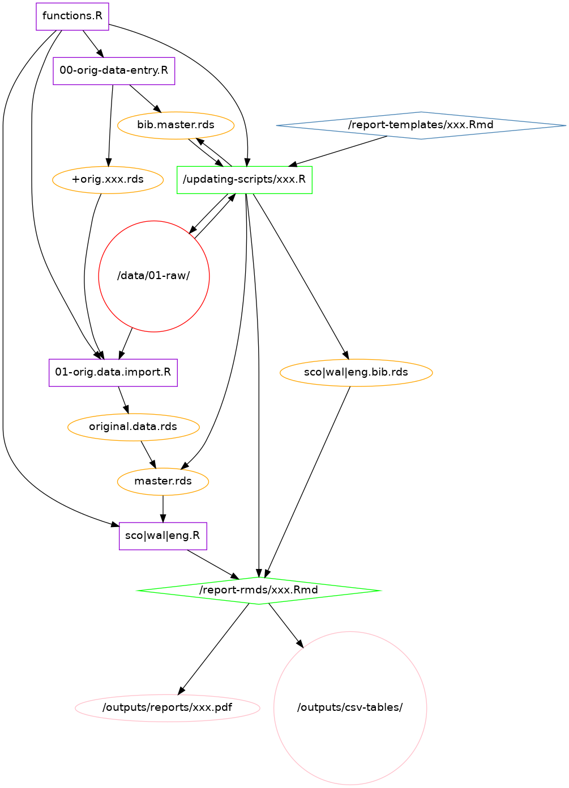

```{r setup, include=FALSE}
knitr::opts_chunk$set(warning= FALSE, message = FALSE)
# PRELIMINARIES
```

# Intro

This document describes the data management pipeline for the parking report automation repository, and describes in detail how users should proceed to add new data and produce new reports. It is highly recommended that you do not skip the first part of the document 

But if you do plan on skipping the description of the pipeline, then at least have a look at the diagram on page 3 and note the following:

* The green indicates the files you should be modifying:
  + The **updating-scripts**, which is the main point of entry, where you choose which year you want the report for and add information on any new data required.
  + The **report-rmds**, which are produced once the update script is run, and where you can add/remove/modify the *text* of the report. 
* The blue **report-templates** you should be more careful with. They are the general templates from which the report rmds are created. So if there is a typo in there, you might as well fix it there once and for all. 
  
Additionally have a look at the folder structure in the appendix and note:

* in green the locations of the updating scripts and report rmds, which is where you should be working mainly.
* in orange the `data/01-raw` folder is where all the raw data is kept. Both the existing data I've already saved there, and all the new files you will be adding.
* in pink the `outputs` folder, which holds both the report pdfs as well as all the csv tables that are produced at the same time. 

# Prerequisites

This was tested on R version `r paste0(R.Version()$major,".", R.Version()$minor)`, with Rstudio 1.2.5001. I do not know how it will behave on older platforms, so maybe just update both.

The following packages need to be installed, but the repository has `renv` initialised, which should take care of this for you, ensuring you have all the packages and that they are the versions that I had when I handed over the repository to you. This means that even if you update your packages elsewhere, the project will still use the packages where this last worked, since there is no need to update them once the thing is up and running. Fingers crossed this works. 

But here's the list anyway. 

```
install.packages("tidyr")
install.packages("dplyr")
install.packages("tibble")
install.packages("RefManageR")
install.packages("curl")
install.packages("readxl")
install.packages("tabulizer")
install.packages("kableExtra)
install.packages("showtext")
install.packages("sf")
install.packages("viridis")
install.packages("classInt")
install.packages("colorspace")
install.packages("rmarkdown")
install.packages("bookdown")
install.packages("here")
install.packages("knitr")
```

Additionally, for you to be able to compile to pdf, you **need to have LaTeX installed**. Now it seems that there is a way to do this simply using TinyTex https://yihui.name/tinytex/. I have not tried this, but the guy that wrote it is a legend and I would trust him with my life. 
You should also have git installed and use it! Make sure you always have a working copy of this repository committed, so you can revert to it in case anything gets messed up. TBH I always get a bit confused with git collaborations, so fingers crossed we don't do anything too complicated. 


# Data Management Pipeline

```{r, echo = FALSE, out.width='85%', fig.cap = "Schematic overview of the data management pipeline"}

```

## The pipeline

This section describes the diagram at the start of this document i.e. how all the scripts and files work together. I'll try to do this in a semi-chronological manner. But most importantly: you should only ever look at and modify the files in the green nodes. And definitely do not modify the purple ones, that's why they live in the folder `code/do-not-touch-scripts"

`00-orig-daya-entry.R` is where all the original manual data entry happened. *Do not touch.*

This script outputs to `bib.master.rds` which started out as the original bibliography, but now gets updated by each updated script (if there is anything new). At the same time the updating scripts also read from the master bibliography file to prepare the subset required for each report. 

`00-orig-data-entry.R` also produced a set of `orig.xxx.rds` files which contained such things as the file names of the raw data files, and the locations of relevant cells in each excel spreadsheet, or metadata. It also contains the manually entered data like the Aberdeen City data, which is in a scanned pdf file. 

These `orig.xxx.rds` metadata files together with the files saved in `/data/01-raw` are the main input for the `01-orig-data-import.R` file, which is where the first big import and clean of the data happened. This includes reading cells from individual sheets in Excel files and merging them together, and reading tables out of pdfs.. This produced a big table with *all* the parking data needed for the reports. This table has a *pit stop* in `original.data.rds`, but ends up being `master.rds`, the table that gets updated with new data by the `updating scripts`

The `updating scripts` are the central point in a way. This is where you choose which year you want the report for and add any metadata that is required. The metadata allows the script to extract the right data from `/data/01-raw`, it updates the bibliography master file, and creates individual bibliographies for each report. Any newly extracted data is added to `master.rds`. 

Once all this is done, the `updating script` makes a copy of the relevant `report-template` and compiles it. This Rmd file does not really do much calculation--the code chunks in the report rmds are exclusively tabulation and plotting--instead I moved the main work to separate analysis files: `scotland.R` and `wales.R`, and  `england.R`. 

These `sco|wal|eng.R` files are the real workhorses, taking the master data and reshaping it in every way required for the tables, the maps and the inline text in the report rmds. While they go along they also save the relevant tables as csv files. *Do not touch.*

The compilation of the report ends up producing a .pdf file, and that's it. 

All along all of the .R script files use the functions that are stored in `functions.R`. *Do not touch.*

Don't worry if it's a bit complicated, you only really need to worry about the two green nodes: the updating scripts and the report-rmds. Instructions on how to use them follow below. 


\newpage

# Instructions for use

These instructions are split into three main parts for three main objectives you might have:

1. You want to just try it out: produce a report based on existing data. 

2. You want to tweak a report you have already produced. 

3. New data has been published and you want to input it and produce a new report. (separate instructions for Wales and Scotland)

NB: I use the first year of the fiscal year to indicate which data we are interested in, so e.g. the report for 2016/17 is produced by setting `current.year` to 2016. 

## Produce a report based on existing data

Although backward compatibility is not in any way guaranteed, it does exist to some extent. So while this pipeline was not meant for you to be able to reproduce old reports, it was a good idea to include that option, since differences in previous years' data inputs made it easier to code against future eventualities. 

**I have not tested this for all possible years,  but you should be fine producing reports for the last couple of years for Wales, but for Scotland 2016/17 is the only one that will work at the moment. **


1. Open the `updating-scripts/wales-update-script.R`. 
2. Scroll to the `MANDATORY INPUTS` section.
3. Change the `current.year` field. e.g. to 2016. 
4. Make sure `add.new.data` is set to `FALSE`.
5. Make sure `recompile.rmd` is set to `FALSE`.
6. Now run through the script. You can source it as well, but I recommend just Ctrl+Enter-ing through it all, so you will be able to see any errors or messages. 
7. When you get to the end, the file should start compiling. It shouldn't take too long.
8. Now go to `outputs/reports/` and have a look at the pdf just created. 
9. If you are unhappy with something in the pdf, go to the Section \@ref(modify) describing how you tweak existing reports. 

## Modify an existing report {#modify}

You have already produced a report, but you want to tweak it.

1. Open the relevant .`.Rmd` file in `code\report-rmds`. 
2. Now you can modify the text. Have a look at section \@ref(format) on formatting for some tips. But the basic rule is to really only change the text portions and avoid changing anything that is in the code chunks, or in inline code. But of course you can, especially captions and table headers etc, just be careful.
3. When you are happy with your modifications, go back to the correct update-script.
4. No, you cannot *knit* the document from the `.Rmd` file itself. ^[I mean you can, but don't. What will happen is the pdf will get compiled into the wrong folder, and all the temp files and logs will also clutter it up. The idea is for the report-rmds folder to just have the rmds and the pdfs to be in the output folder.]  Go back to the update-script. 
5. Now make sure the following holds:
* the `current.year` variable is set to the same year as the report you have just modified (check the file name to be sure)
* Make sure `add.new.data` is set to `FALSE`.
* Make sure `recompile.rmd` is set to `TRUE`. This is important, otherwise all your tweaking work will be overwritten. 
6. Now run the whole script again. It will recompile the pdf with our updates. 
7. Have a look at the pdf, and if you are not satisfied go back to point 1. 


## Preparing a new report based on new data: Wales

1. When the new parking data for Wales becomes available, you need to download the csv files from this website: [Road and trasnport reveny exbepditure by authority](https://statswales.gov.wales/Catalogue/Local-Government/Finance/Revenue/Transport/RoadsAndTransportRevenueExpenditure-by-authority)
2. You will need to export three tables using the export button at the top of the table. Make sure you: 
* **export to .csv, without headers, without metadata**
* save them to `data/01-raw`
* pick a sensible name - e.g. the ones suggested below. 
3. Select the following three tables: 
* column: Gross Expenditure; row: Parking of vehicles -> `wal-exp-17-18.csv` 
* column: Total Income; row: Parking of vehicles -> `wal-inc-17-18.csv`
* column: Net current cost row: Total transport planning, highways, rows and transport -> `wal-trans-17-18.csv`
4. Now open `code/updating-scritps/wales-update-script.R` and scroll down to the *Mandatory inputs* section. 
5. Change the `current.year` field. to the most recent year the data has become available for
6. Make sure `add.new.data` is changed to `TRUE`.
7. Make sure `recompile.rmd` is set to `FALSE`.
8. Then continue to the *Manual input* section.
9. Enter the file names of the three files you have just downloaded. Just the name, not the path.
10. Update the access date.
11. Now run through the whole file. The script will update the `master.rds` file with the new data as well as updating the bibliography to include the newly added data. Finally it will produce an .Rmd, a pdf and the csv tables. 
12. If you wish to modify the report go to Section \@ref(modify).
13. When you are happy with the whole thing you should make a commit.


## Preparing a new report based on new data: Scotland

1. When the new parking data for Scotland becomes available, you need to download following files, while *taking note of the urls* where you got them
*  *Income and expenditure* is available on this website:[Scottish Local Government Financial Statistics](https://www2.gov.scot/Topics/Statistics/Browse/Local-Government-Finance/PubScottishLGFStats), look for the "Annex A by LA" link. Download the file to `/data/01-raw` e.g. as `sco.i.e.17-18.xlsx`
*  *Aberdeen data* is available on this website: [Annual accounts](https://www.aberdeencity.gov.uk/services/council-and-democracy/financial-information-and-procurement/annual-accounts).  Download the file for this year to `/data/01-raw` e.g. as `sco.abd.17-18.pdf`
*  *PCN data* is available on this website: [Transport Scotland](https://www.transport.gov.scot/publication/decriminalised-parking-enforcement-local-authorities-income-and-expenditure-2017-to-2018/). Search for the DPE report for the current year and download it to `/data/01-raw` e.g. as `sco.pcn.17-18.pdf`
5. Now open `code/updating-scritps/scotland-update-script.R` and scroll down to the *Mandatory inputs* section. 
6. Change the `current.year` field. to the most recent year the data has become available for
7. Make sure `add.new.data` is changed to `TRUE`.
8. Make sure `recompile.rmd` is set to `FALSE`.
9. Then continue to the *Manual input* section.
10. For each of the three files you will need to manually input all the information requested in the script. This includes bibliographical info like title, link, date accessed for the files. 
11. Additionally for the Excel file you will need to open the files and find which cells/sheets the relevant data is on and input that as well. 
12. For the Aberdeen data you will need to open the pdf and look for the heading "Trading operations", usually about 80 pages in, and a few pages further you will find the table with the row "Provision and Management of Car parking facilities". You will need the turnover and expenditure numbers for the last year, which you input in the script as well. 
13. For the DPE/PCN data you need to open the file and check which pages in the pdf the three required tables are located and input them. 
14. Now run through the whole file. The script will update the `master.rds` file with the new data as well as updating the bibliography to include the newly added data. Finally it will produce an .Rmd, a pdf and the csv tables. 
15. If you wish to modify the report go to Section \@ref(modify).
16. When you are happy with the whole thing you should make a commit.


## Preparing a new report based on new data: England

1. When the new parking data for England becomes available, you need to download following files, while *taking note of the urls* where you got them:
2.  *England Outturn Data* is available on this website:[Local Authority Revenue and expenditure](https://www.gov.uk/government/collections/local-authority-revenue-expenditure-and-financing): 
* look for the link called *Local authority revenue expenditure and financing England: 20XX to 20XY individual local authority data - outturn* -- make sure it has both LA and outturn in the name
* Select the Excel file "Revenue outturn highways and transport services (RO2) 20XX to 20XY"
* Download the file to `/data/01-raw` e.g. as `eng.17-18.xlsx`
* take note of the url for the excel file!
3. *England budget data for the next fiscal year*  is available on the same site as the outturn data above, but make sure it's for the next fiscal year!
* look for the link called *Local authority revenue expenditure and financing England: 20XY to 20ZZ budget individual local authority data*  -- make sure it has both LA and budget in the name, and is for the next fiscal year!
* Select the Excel file "Revenue account (RA) budget 20XY to 20ZZ". 
* Download the file to `/data/01-raw` e.g. as `eng.18-19-budget.xlsx`
* take note of the url for the excel file!
4. Now open `code/updating-scritps/england-update-script.R` and scroll down to the *Mandatory inputs* section. 
5. Change the `current.year` field. to the most recent year the data has become available for
6. Make sure `add.new.data` is changed to `TRUE`.
7. Make sure `recompile.rmd` is set to `FALSE`.
8. Then continue to the *Manual input* section.
9. For each of the three files you will need to manually input all the information requested in the script. This includes bibliographical info like title, link, date accessed for the files. 
10. Additionally for the Excel files you will need to open the files and find which cells/sheets the relevant data is on and input that as well, following the script carefully. 
11. BE careful, these cells will probably stay pretty similar over the years, but may change as well, so make sure you update all the fields. 
13. Now run through the whole file. The script will update the `master.rds` file with the new data as well as updating the bibliography to include the newly added data. Finally it will produce an .Rmd, a pdf and the csv tables. 
14. If you wish to modify the report go to Section \@ref(modify).
15. When you are happy with the whole thing you should make a commit!


## Formatting of the reports {#format}

Once you have the pdf there will invariably be things you want to change. Here are some tips as well as some things that you cannot (easily change):

Body text is straightforward to change ^[Here is a link to the [rmarkdown cheatsheet](https://www.rstudio.com/wp-content/uploads/2015/02/rmarkdown-cheatsheet.pdf) with all basic formatting tips. Print it out and stick it on your wall. 
]. But be careful. You should have colour-coded syntax in Rstudio, so you can easily see what is plain text (white) and what is inline code (orange on my computer). Pay attention to this!! Never change anything orange!

You can add footnotes using `[^ text of footnote.]` wherever you wish. 

In some places where I felt the text will need your attention I have highlighted it in red in the pdf. In the Rmd this will be bracketed by `\color{red}` and `\color{black}`. When you have modified the text to your satisfaction simply delete these tags, and the text will be black again. 

**Positioning of text/tables/charts**: so this is a bit of a tricky subject. The honest truth is that you will have less control than you might hope for, and some annoying things might happen:

* text and tables might overflow over the bottom of the page. In this case the solution is to use the command `\newpage` strategically placed just before you want the page to break. Don't ask why this happens, it's complicated.
* Figures will tend to "float" to the bottom of the document. This is a known issue in LaTeX generally, but in rmarkdown it is even more difficult to control. It is particularly noticeable in reports like this, because they are so heavy on *floats* i.e. tables and charts, and have relatively little text. So there is really no solution, but to not worry too much about it. It will all be in the report, just not at the exact location you might want. But the order should remain correct. 

Captions: You will be able to change the figure captions in the chunk headers under `fig.cap=`. You will also be able to change the table captions, by looking inside the table chunk for the `kable` argument `caption =`. Probably don't try to fiddle too much with the other settings in the `kable` functions unless you are comfortable with `kableExtra`.

Be very careful with the YAML headers at the top of the .Rmd files. They are super sensitive to indentation, and if you copy paste them around it will guaranteed get messed up!

If you want to change the **citation style** you can. I used APA and tweaked it a bit. You can use [this style editor](http://editor.citationstyles.org/visualEditor/) to pick a style you like and tweak it. Then save it in the `reports-rmds` folder *AND* then you have to replace the `cls` code in the report template YAML headers: in both report templates at the top there is currently a line that reads `csl: apa-with-notes.csl`, replace it with your new .cls file. 

Another note on the **citation style**: when you are entering the metadata in the update file you want to put the authors names and the titles in between `{ }`  braces, that way the capitalisation of the title stays the same, and the author name doesn't get shortened. 

Changing *fonts* is generally a pretty tricky operation, so I have made no plans for that being an option. The one thing I was able to do was to change the fonts in the plots to something nicer than the default. Unfortunately that does not work in the maps for some reason. 

The *colours* in the maps are also not easily changeable, so I hope you appreciate them as they are. Just to explain what I did, the palettes are calculated for each pair of maps in order to encompass the whole range for both the current change and the average change over four years making the maps, and the relevant two columns in the table directly comparable. Furthermore the colour palette splits at zero, proportionately to the minimum and maximum keeping the gradient smooth. And I took a chunk out at zero meaning the *good* side always starts slightly greenish and the *bad* side starts slightly orangish, making it clear which ones are positive and which negative. 


\newpage
# Appendix: Folder structure {-}

\color{black}
`|-- code` 

`|   |-- do-not-touch-scripts` \color{green}

`|   |-- report-rmds` \color{black}

`|   |-- report-templates` \color{green}

`|   \-- updating-scripts` \color{black}

`|-- data` \color{red}

`|   |-- 01-raw` \color{black}

`|   |   |-- fonts`

`|   |   \-- maps`

`|   |-- 02-interim`

`|   \-- 03-processed`

`|-- docs`

`|   |-- admin`

`|   |-- journal`

`|   |-- original-reports`

`|   \-- technical` 

`|        \-- instructions`\color{magenta}

``-- outputs`

`.   |-- csv-tables`

`.   |   |-- scotland-2016-17`

`.   |   \-- wales-2017-18`

`.   \-- reports` \color{black}


This is a quick overview of what is what in the repository folder structure. 

### `code`

Contains all the `.R` and `.Rmd` files. Additionally contains the bibliography files and bib style file, which have to be in the same folder as the Rmds. 

#### do-not-touch-scripts

* `00-orig-data-entry.R` contains **manually** input data and metadata, including references for existing sources, manually input data from scanned pdfs, and lookup tables for when LA names have spelling variants and typos. *do not modify*
* `01-orig-data-entry.R` contains code to **programatically** extract and clean data from all the original data sources and produce the `original.data.rds`, which immediately becomes the `master.rds`. *do not modify*
* `functions.R` contain all the helper functions used by pretty much all the other `.R` files. *do not modify*
* `scotland.R` and `wales.R` and `england.R` contain the code run by each .Rmd file. This code was originally in the `.Rmd` files themselves, but that made them extremely long an difficult to navigate, so I moved it out. *do not modify*
* `xx-scratchpad.R` - my playground, ignore this, will be deleted if it hasn't been already. 

#### `updating-scritps`

This folder contains the updating scripts for Scotland and Wales and  England. These are R scripts that require you to first input some parameters, then when they are run they produce a new Rmd file, which is compiled into a pdf file and produces the csv tables as well. 

#### `report-templates`

This folder contains .Rmd report templates for Scotland and Wales and England. A copy is made automatically by the updating script. So if there is a typo in the report, this is where it originates from. 

#### `report-rmds`

This folder contains the individual report .Rmd files. They are produced automatically by the update scripts. You can modify them here, but do not *knit* them directly, instead use the update script again. Otherwise you will clog this folder up whit unnecessary files. 

### `data`

This folder contains all the raw data inputs and the processed files that are used by the scripts.

#### `01-raw`

The raw data goes in here. These files are downloaded and saved into this folder and should never be changed. 

Additionally this folder also contains the shapefiles in the `/maps` subfolder, and the font used in the charts in the `/fonts` subfolder. 

#### `02-interim`

This folder should only contain the `original.data` dataset, which is the interim file created after the initial input of the original data. You should not need to do anything here.

#### `03-processed`

This folder contains the outputs of the update scripts, which are used in the report compilation: 

* the `master` dataset, which has all the available data for all the countries and all the years, and gets automatically updated via the update scripts; 

* the `bib.master` dataset, which is the complete bibliography for all the data sources and also gets automatically updated via the update scripts,

* the individual bibliography objects for each report. 

None of this needs any attention. 

### `docs`

#### `admin`

Not important

#### `journal`

Contains the journal of this analysis as well as the queries sent during its course.

#### `original-reports`

Contains all the Leibling reports

#### `technical`

`instructions`: Contains this user manual.

`technical-docs`: Will contain the technical appendices for the reports.

### `outputs`

All the outputs of the analysis are in this folder

#### `csv-tables`

Contains a subfolder for each report containing the numbered tables in csv format. 

#### `reports`

The pdf reports are saved here. 
